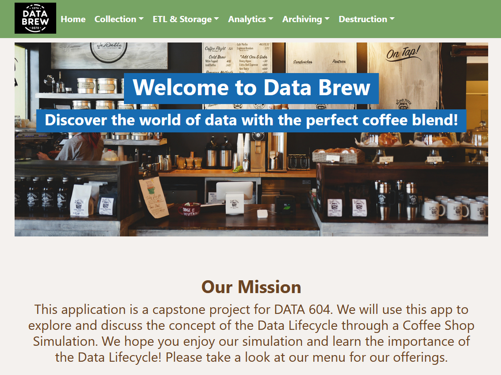

# Data Lifecycle in a Business Environment
The web app "Data Brew" serves as a capstone project for DATA 604, focusing on exploring the Data Lifecycle through a Coffee Shop Simulation. It aims to educate users on how data flows through a business environment by offering an interactive experience where they can engage with the stages of data collection, processing, analysis, and decision-making in a simulated coffee shop setting. The app also features a menu with various coffee, tea, chocolate, and bakery items, enhancing the simulation experience.

For more detailed information, please visit the [Data Brew application's website](https://data604app-899e0854b7f2.herokuapp.com/).

